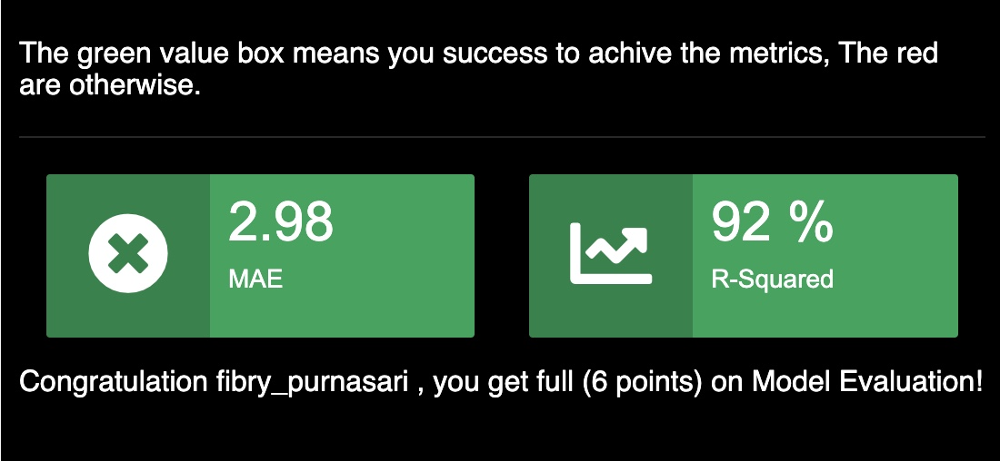

# Introduction 

```{r, echo=FALSE, fig.height=8, warning=FALSE}
knitr::include_graphics("concrete.png")
```
[Source Of Picture](https://www.cement.org/cement-concrete/how-concrete-is-made)

Concrete is a simple mixture of paste and aggregates, or called rocks. The paste, which mixes cement and water, coats the surface of the fine and coarse rocks. Then, the paste becomes hard and gains strength to form the concrete through a chemical reaction called hydration [[^6]](https://www.cement.org/cement-concrete/how-concrete-is-made). 

Compression strength is an accepted measure to access the performance of a given concrete mixture. It determines how well the concrete can withstand loads that affect its size. However, observing the strength of the concrete structure will take too long due to its resting time. Thus, in this study, we are going to predict the compression strength of concrete based on several factors, such as water, cement, aggregate, blast furnace slag and the resting time. The study was originally proposed by Prof. I-Cheng Yeh, Department of Information Management Chung-Hua University, Hsin Chu, Taiwan in 2007. 

# Objective 

This study is a part of the final Capstone Project from Algoritma Academy Data Science Course [[^3]](https://algorit.ma.). As mentioned above, the objective of this study is to predict the compression strength of concrete based on several mixture properties. In this study, we will implement several machine learning models, such as Multiple Linear Regression, Random Forest, and Extreme Gradient Boost (XGBoost). Then, we will choose the optimal model based on the MAE and R-squared values from the predictions of the test dataset. The threshold of model evaluation is less than 4 for MAE and more than 90% for the R-squared value. Lastly, the interpretation of the best model will be explained by using the LIME. 

# Data Preparation 

## Load Libraries

The following are all libraries used in this study.

```{r, warning=FALSE, message=FALSE}

# Data Wrangling
library(tidyverse)
library(tidymodels)

# Exploratory Data Analysis
library(GGally)
library(inspectdf)

# Modeling and Evaluation
library(randomForest)
library(lmtest)
library(performance)
library(car)
library(xgboost)
library(caret)
library(MLmetrics)
library(tictoc)

# Model Interpretation
library(lime)

# Set theme for visualization
library(hrbrthemes)
library(wesanderson)
library(plotly)

# Create PCA 
library(factoextra)
library(FactoMineR)

options(scipen = 999)
```


## Read Dataset 

Let's read dataset `data-train.csv` by using function `read.csv()` and assign it as a new dataframe `concrete`. 

```{r}
concrete <- read.csv("data/data-train.csv")
```

## Observe Dataframe

Observe dataframe by using function `str()`. 

```{r}
str(concrete)
```
The output shows that there are **825** observations and **10** variables. We do not have to change the data type because all variables already have the correct type. However, we need to drop column `id`, because we are not going to use it. 

The target variable is `strength` and the potential predictors are `cement`,  `slag`, `flyash`, `water`, `super_plast`, `course_agg`, `fine_agg`, and `age`. The observation data consists of the following variables:

- **id** : Id of each cement mixture,
- **cement** : The amount of cement (Kg) in an m3 mixture,
- **slag** : The amount of blast furnace slag (Kg) in an m3 mixture,
- **flyash** : The amount of fly ash (Kg) in an m3 mixture,
- **water** : The amount of water (Kg) in an m3 mixture,
- **super_plast** : The amount of Superplasticizer (Kg) in an m3 mixture,
- **coarse_agg** : The amount of Coarse Aggregate (Kg) in a m3 mixture,
- **fine_agg** : The amount of Fine Aggregate (Kg) in an m3 mixture,
- **age** : The number of resting days before the compressive strength measurement,
- **strength** : Concrete compressive strength measurement in MPa unit.

## Features Selection 

As mentioned above, we will drop the `id` column. 

```{r}
concrete <- concrete %>% 
  dplyr::select(-id)
```

## Missing Value

We can observe missing value by using function `colSums(is.na())`. Based on the output, we do not have missing value in dataframe. 

```{r}
colSums(is.na(concrete))
```

# Exploration Dataset

## Near-Zero Variance

Since all variables are numeric, then we can use function `inspect_num()` from package `inspectdf` and pipe it with `show_plot()` to visualize the distribution (histogram plot) of each variable. 

```{r}
inspect_num(concrete) %>% 
  show_plot()
```

Variable `age`, `slag`, `flyash` and `super_plast` have right-skew because most of the values are distributed on the low side. Those variables also have a high quantity of zero value. This might indicate variable with near-zero variance. We should handle near-zero variance because it does not affect our model. 

Since we should not depend only on the visualization. Thus, we can check the near-zero variance by using function `nearZeroVar()` from `caret`. 

```{r}
rmarkdown::paged_table(nearZeroVar(concrete, saveMetrics = T))
```

Based on the above table, there are no variables classified as a near-zero variance. 

## Outlier And Range

To observe the outlier and range of distribution in each variable, we can create the boxplot.

```{r}
dist_plot <- ggplot(data = concrete %>% gather(key = "Variable", value = "Value"), aes(Variable, Value)) +
  geom_boxplot(aes(fill=Variable))+
  theme_ipsum()+
  scale_fill_manual(values = wes_palette(10, name = "Darjeeling1", type = "continuous"))+
  theme(axis.text.x = element_text(angle = 90),
        text = element_text(family="Arial Narrow"),
        axis.title.x = element_blank())+
  labs(title= "Distribution : Boxplot Numeric Variables")

# Show as ggplotly
ggplotly(dist_plot) %>% hide_legend()
```

As shown in the above plot, `age`, `slag`, `fine_agg`, `strength`, `super_plast` and `water` have an outlier. We will treat outliers differently between target and predictor. For the target variable, we eliminate outliers, and for predictor, we implement PCA (Principal Component Analysis) to observe the anomaly or outlier in the dataset. 

**Note** : We use the original dataset for our main model, while the dataset without outliers will be used as our comparison to our original model. 

The range of the variable is quite different. It is often recommended to scale the feature in the dataframe before fitting the model. In regression, the scaling (such as standardization) does not influence the statistical inference among variables, and therefore we will always end up interpreting equivalently the coefficients [[^11]](https://stats.stackexchange.com/questions/29781/when-conducting-multiple-regression-when-should-you-center-your-predictor-varia). Thus, we will not scale our dataset for the original model. However, to provide an answer to our curiosity,  we will also perform scaling by using z-score.

The transformation of the target variable by using z-score standardization is advisable if we found a model violation in homoscedasticity. While the transformation of features by using min-max, log, square-root or z-score standardization is advisable if we found a violation in the normality of residuals. However, we will not implement it in this study. 

## Handling Outlier

### Target 

First, let's observe how many outliers in our target variable 

```{r}
boxplot(concrete$strength, plot=FALSE)$out
```

We have only five outliers in our target and we will eliminate them by using the below code. Then, we assign a clean dataset as  `concrete_clean_target` 

```{r}
# Define outlier for target variable
outliers <- boxplot(concrete$strength, plot=FALSE)$out

# Dataframe without outlier in the target 
concrete_clean_target <- concrete[-which(concrete$strength %in% outliers),]
```


### Predictor

Before implementing the PCA, we should scale the predictor using a z-score. We use a z-score to ensure the variable distributions have a mean zero and standard deviation of 1. We use a dataset without outlier in the target `concrete_clean_target` 

```{r}
# Remove the target variable
concrete_scale <- scale(concrete_clean_target[,-9])
```

```{r, echo=FALSE}
concrete_scale <- as.data.frame(scale(concrete_clean_target[,-9]))
rmarkdown::paged_table(head(concrete_scale))
```

As shown in the above table, all variables have been scaled. Now, we will continue to build the PCA. We use the function `PCA()` from library `factoMiner` to implement PCA and assign it as a new object called `concrete_pca`. 

```{r}
concrete_pca <- PCA(X = concrete_scale, 
                scale.unit = F, #Already scale scale
                graph = FALSE, #No graph visualization
                ncp = 9) #Number of numeric columns
```

Since we are only interested in the outlier, we can use the individual plot by using `plot.PCA()`. The individual plot illustrates the observations as points in the plane formed by two principal components. 

```{r}
plot.PCA(x=concrete_pca,
         choix="ind",
         invisible="quali",
         select="contrib 4") # Show based on variable strength

```

The plot captures four outliers, which are observation number 4,6,28, and 29. Then, we will create a new data frame called `concrete_outlier`, which does not contain the outlier. This dataset will be used to build a model that will be compared to our original model. 

```{r}
# Identify outliers and assign as a list called `outlier`
outlier <- c(4,6,28,29)

# Create a dataframe `concrete_outlier` without the outlier 
concrete_outlier <- concrete[!(row.names(concrete) %in% outlier),]
```


## Correlation 

Check the correlation between target and predictor by using `ggcorr()`.

```{r, warning=FALSE}
ggcorr(concrete, 
       label = T, 
       size = 3, hjust = 0.1, color='black', angle=90,
       layout.exp = 3,
       cex = 3,
       low = "#FFC75F", high = '#D83121', mid = 'white')+
labs(title = 'Correlation Matrix')+
theme(plot.title = element_text(size=20),
      legend.text = element_text(size = 12))
```

> Insight : 
>
- `strength` has positive correlation with `age`, `super_plast`, `slag`, and `cement`. 
- `strength` has negative correlation with `fine_agg`, `course_agg`, `water`, and `flyash`.
- `strength` has a medium positive relationship with `cement`. On the other side, `strength` has a weak correlation with other variables. 
- The strong negative correlation is just indicated by `water` and `super_plast`.

## Linearity Relationship

Linearity between predictor and target variable can be observed by using a statistical test of Pearson's product-moment correlation. Linearity is actually one of the assumptions required for a linear regression model, which assumed that there must be a linear correlation between predictor and target. 

We will use `cor.test()` to check the p-value of all variable predictors. The expectation is to have a p-value less than alpha (p-value < 0.05), so we will reject the $H_0$. Linearity hypothesis test: 

$$
H_0: correlation\ is\ not\ significant\\
H_1: correlation\ significant
$$

```{r, results='hide'}
cor.test(concrete$water, concrete$strength)[3]
cor.test(concrete$slag, concrete$strength)[3]
cor.test(concrete$cement, concrete$strength)[3]
cor.test(concrete$flyash, concrete$strength)[3]
cor.test(concrete$super_plast, concrete$strength)[3]
cor.test(concrete$age, concrete$strength)[3]
cor.test(concrete$fine_agg, concrete$strength)[3]
cor.test(concrete$coarse_agg, concrete$strength)[3]
```

```{r, echo=FALSE}

m <- data.frame(water_strength = cor.test(concrete$water, concrete$strength)[[3]],
slag_strength=cor.test(concrete$slag, concrete$strength)[[3]],
cement_strength=cor.test(concrete$cement, concrete$strength)[[3]],
flyash_strength=cor.test(concrete$flyash, concrete$strength)[[3]],
super_plast_strength=cor.test(concrete$super_plast, concrete$strength)[[3]],
age_strength=cor.test(concrete$age, concrete$strength)[[3]],
fine_agg_strength=cor.test(concrete$fine_agg, concrete$strength)[[3]],
coarse_agg_strength=cor.test(concrete$coarse_agg, concrete$strength)[[3]])

rmarkdown::paged_table(m)
```

> Insight: As shown in the output, the p-values of all variables are less than alpha (0.05), thus we can conclude that all predictors in this dataset have a significant or linear correlation with our target variable (strength). This also confirms the question that the `super_plast` has a linear relationship with `strength`. 

# Linear Regression 

## Multiple Linear Regression

**Multiple Linear Regression** is a regression model that uses several explanatory variables to predict the outcome of the target variable. This model is also an extension of OLS (Ordinary Least Square) regression that just only uses one predictor. 

### Cross-Validation  

Cross-validation is splitting up our dataset into a train and test set. In this study, our train data will be used to train, validation data is used to evaluate the model, and the test dataset is used for the final evaluation. We will assign each dataset by following name : 

- Train dataset : `concrete_train`
- Validation dataset : `concrete_test` 
- Test dataset : `concrete_submit`

We will use the `concrete` dataframe as our original model. We use function `sample()` and then specify the proportion of train data is *80%* and validation data is *20%*. 

```{r, warning=FALSE}

# Lock random samples 
RNGkind(sample.kind = "Rounding")
set.seed(500) 

# Create train dataset with 80% of total row in dataframe and the rest is used to evaluate the model. 
insample <- sample(nrow(concrete), nrow(concrete)*0.8)

# Create concrete_train as our train data
concrete_train <- concrete[insample,]

# Create concrete_test as our validation data
concrete_test <- concrete[-insample,]
```

Now, create a new object called `concrete_submit` as test dataset used for the final model evaluation 

```{r}
# Create an object for test dataset
concrete_submit <- read.csv("data/data-test.csv")

# Observe the dataframe
head(concrete_submit)
```

As shown in the table, the `strength` column is empty and we require to fill it from the prediction of our best model before submitting to leaderboard to obtain final model evaluation. 

The proportion of our dataset is **64%** for train data, **16%** for validation data and **20%** for test data

```{r}
a <- nrow(concrete_train)
b <- nrow(concrete_test)
c <- nrow(concrete_submit)

a/(a+b+c)
b/(a+b+c) 
c/(a+b+c) 
```

### Model Fitting 

In this section, we create linear model regression based on a different number of predictors.

- **First part** : We construct the linear model regression with the target variable as `strength` and variable predictors are other variables. We name the model `model_concrete_all`.
- **Second part** : We construct the linear model regression with the target variable is `strength` and variable predictors, which have a significant p-value as described in `model_concrete_all`. We call the model `model_concrete_few`.
- **Third part** : We construct the linear model regression with the target variable is `strength` and the variable predictor is `cement`, which have the highest correlation with `strength`. We call the model `model_concrete_one`.

### All Variables 

We use the function `lm()` to generate the model. 

```{r}
# Fit the model 
model_concrete_all <- lm(formula = strength~., 
                         data= concrete_train)

# Summary of the model
summary(model_concrete_all)
```
- The adjusted R-squared is 0.6118, implying that all predictor variables can only describe 61.18% target variable, the rest is explained by other variables that are not included in the model.
- All variable predictors, except fine_agg have a significant p-value, implying that those variables have a high contribution to the target. 

### Few Variables 

In here, we use only predictor that have p-value less than alpha (0.05)

```{r}
# Fit the model 
model_concrete_few <- lm(strength~ cement+slag+flyash+water+age+super_plast, concrete_train)

# Summary of the model
summary(model_concrete_few)
```

The adjusted R-squared is 0.6096, implying that all predictor variables can only describe 60.96% target variable, the rest is explained by other variables that are not included in the model. The R-squared value is relatively close with the model with all variable predictors. 

### One Variable

In here, we use only `cement` as our predictor. 

```{r}
# Fit the model 
model_concrete_one <- lm(strength~ cement, concrete_train)

# Summary of the model
summary(model_concrete_one)
```
The multiple R-squared is 0.2361, implying that the predictor variable can only describe 23.61% target variable, the rest is explained by other variables that are not included in the model. The R-squared value is low compared to other models. It indicates that only one predictor could not explain the model very well. 

### Model Evaluation 

Model evaluation uses **MAE (Mean Absolute Error)** and **predicted R-squared** values. The predicted R-squared is used to indicate how well a regression model predicts the target for new observations. While MAE measures the average over the test sample of the absolute differences between prediction and actual observation where all individual differences have equal weight. 

```{r, echo=FALSE}
# Prediction for validation dataset
pred_all <-predict(object=model_concrete_all, newdata=concrete_test)
pred_all_train <-predict(object=model_concrete_all, newdata=concrete_train)
pred_few <-predict(object=model_concrete_few, newdata=concrete_test)
pred_few_train <-predict(object=model_concrete_few, newdata=concrete_train)
pred_one <-predict(object=model_concrete_one, newdata=concrete_test)
pred_one_train <-predict(object=model_concrete_one, newdata=concrete_train)

# Generate R-squared and MAE values. 
sum<- list(
  
  "Models" = c("All variables Validation", "All variables Train", "Few variables Validation", "Few variables Train", "One variable Validation", "One variable Train"), 
  
  "R_Squared" = c(R2_Score(y_pred = pred_all, y_true = concrete_test$strength),
                  R2_Score(y_pred = pred_all_train, y_true = concrete_train$strength),
                  R2_Score(y_pred = pred_few, y_true = concrete_test$strength),
                  R2_Score(y_pred = pred_few_train, y_true = concrete_train$strength),
                  R2_Score(y_pred = pred_one, y_true = concrete_test$strength),
                  R2_Score(y_pred = pred_one_train, y_true = concrete_train$strength)),
  
  "MAE" = c(MAE(y_pred=pred_all, y_true=concrete_test$strength), 
            MAE(y_pred=pred_all_train, y_true=concrete_train$strength),
            MAE(y_pred=pred_few, y_true=concrete_test$strength),
            MAE(y_pred=pred_few_train, y_true=concrete_train$strength),
            MAE(y_pred=pred_one, y_true=concrete_test$strength),
            MAE(y_pred=pred_one_train, y_true=concrete_train$strength)))
```

```{r, echo=FALSE}
sum <- as.data.frame(sum)
rmarkdown::paged_table(sum)
```
> Insight: Model with all and few predictor have relatively close R-squared and MAE values. Those have better performance compared to a model with one variable as a predictor. Since the threshold of being overfit is 10% (difference R-squared and MAE between the train and validation), all models are considered balance (not overfit).

## Stepwise Method 

In this section, we would like to compare three methods of stepwise regression (backward, forward and both). Stepwise regression is the step-by-step iterative construction of a regression model that involves the selection of independent variables to be used in a final model. 

### Backward Method

Backward regression involves removing potential variables in succession and testing for statistical significance after each iteration until the lowest AIC is achieved. 

```{r}
model_concrete_backward <- stats::step(model_concrete_all, 
                              direction="backward",
                              trace=0)
```

### Forward Method

Forward regression involves adding potential variables in succession and testing for statistical significance after each iteration until the lowest AIC achieved. 

```{r}
# Create a model without the variable predictor
model_concrete_non <- lm(strength~1, concrete_train)

# Create forward model
model_concrete_forward <- stats::step(object=model_concrete_non, 
                          direction="forward",
                          scope=list(upper=model_concrete_all,
                                     lower=model_concrete_non), trace=0)
```

### Both Method

Both stepwise regression involves adding and removing potential variables in succession and testing for statistical significance after each iteration until the lowest AIC achieved.

```{r}
model_concrete_both <- stats::step(object=model_concrete_non, 
                          direction="both",
                          scope=list(upper=model_concrete_all,
                                     lower=model_concrete_non), trace=0)
```


### Model Evaluation 

```{r, echo=FALSE}
# Prediction for validation dataset 
pred_back <-predict(object=model_concrete_backward, newdata=concrete_test)
pred_for <-predict(object=model_concrete_forward, newdata=concrete_test)
pred_both <-predict(object=model_concrete_both, newdata=concrete_test)

# Generate R-squared and MAE values. 
k <- list(
  "Models" = c("Backward", "Forward", "Both"), 
  
  "R_Squared_Validation" = c(R2_Score(y_pred = pred_back, y_true = concrete_test$strength),
                           R2_Score(y_pred = pred_for, y_true = concrete_test$strength),
                           R2_Score(y_pred = pred_both, y_true = concrete_test$strength)),
  
  "MAE_Validation" = c(MAE(y_pred=pred_back, y_true=concrete_test$strength), 
            MAE(y_pred=pred_for, y_true=concrete_test$strength),
           MAE(y_pred=pred_both, y_true=concrete_test$strength)))

k <- as.data.frame(k)
rmarkdown::paged_table(k)

```
> Insight: All models with stepwise method shows similar result of R-squared and MAE value. This result also is quite similar with model with multiple linear regression. 

## Multiple Linear Regression Without Outlier

### Model Fitting

In this section, we will generate model linear regression by using `concrete_outlier` dataframe. 

```{r, warning=FALSE}
# Lock random samples 
RNGkind(sample.kind = "Rounding")
set.seed(500) # Lock the random sample

# Cross-Validation
insample <- sample(nrow(concrete_outlier), nrow(concrete_outlier)*0.8)

# Data train
concrete_train_out <- concrete_outlier[insample,]

# Data validation
concrete_test_out <- concrete_outlier[-insample,]

# Build model
model_concrete_out <- lm(strength~., concrete_train_out)
```

### Model Evaluation 

Now, we compare the model evaluation of model with and without outlier. 

```{r, echo=FALSE}

# Prediction for train and validation dataset
pred_all <-predict(object=model_concrete_all, newdata=concrete_test)
pred_out <-predict(object=model_concrete_out, newdata=concrete_test_out)
pred_all_train <-predict(object=model_concrete_all, newdata=concrete_train)
pred_out_train <-predict(object=model_concrete_out, newdata=concrete_train_out)

# Generate predicted R-squared and MAE values. 
j <- list(
  "Models" = c("Model With Outlier Train", "Model With Outlier Validation", "Model Without Outlier Train", "Model Without Outlier Validation"), 
  
  "R_Squared" = c(R2_Score(y_pred = pred_all_train, y_true = concrete_train$strength),
                  R2_Score(y_pred = pred_all, y_true = concrete_test$strength),
                  R2_Score(y_pred = pred_out_train, y_true = concrete_train_out$strength),
                  R2_Score(y_pred = pred_out, y_true = concrete_test_out$strength)),
  
  "MAE" = c(MAE(y_pred=pred_all_train, y_true=concrete_train$strength), 
            MAE(y_pred=pred_all, y_true=concrete_test$strength), 
            MAE(y_pred=pred_out_train, y_true=concrete_train_out$strength), 
            MAE(y_pred=pred_out, y_true=concrete_test_out$strength)))

j<- as.data.frame(j)
rmarkdown::paged_table(j)
```

> Insight : As shown in the output, the model without outlier slightly improve the R-squared value but not for MAE. Both models are classifisied as balance model (not overfit).

## Multiple Linear Regression With Log Transformation 

In this section, we will transform the predictor and target variable with a log. We use log transformation because we want to reduce the right skewness as mentioned in the boxplot. The log transformation will compress the high values and spread the low value by expressing the values as orders of magnitude. 

### Fitting Model 

Since some of values are zero, we will use `log1p()`. The `log1p()` is used to calculate logarithm of `1+x`, where `x` is the specified value and throws infinity for `0` and `NaN` for negative value. 

```{r}
# Generate Model
model_log <- lm(strength~., log1p(concrete_train_out))

# Observe model
summary(model_log)
```
Now, let's compare it with `model_concrete_out` 

```{r}
summary(model_concrete_out)
```
The residual standard error in log transformation model reduces significantly from 10.29 to 0.23 and the adjusted R-squared value also increases. 

### Model Evaluation 

```{r}
# Backtransform the prediction for train and validation dataset using `expm1()`
pred_log_test <- expm1(predict(model_log, log1p(concrete_test_out)))
pred_log_train <- expm1(predict(model_log, log1p(concrete_train_out)))
```

```{r, echo=FALSE}

m <- list(
  "Models" = c("Model Log Train", "Model Log Validation"), 
  
  "R_Squared" = c(R2_Score(y_pred = pred_log_train, y_true = concrete_train_out$strength),
                  R2_Score(y_pred = pred_log_test, y_true = concrete_test_out$strength)),
  
  "MAE" = c(MAE(y_pred=pred_log_train, y_true=concrete_train_out$strength), 
            MAE(y_pred=pred_log_test, y_true=concrete_test_out$strength)))

m<- as.data.frame(m)
rmarkdown::paged_table(m)
```

> Insight : This model generates the highest R-squared and the lowest MAE value compared to other Linear Regression model. Additionally, based on MAE and R-squared, the model is balance or not overfit. 

## Multiple Linear Regression Scale (tidy models)

In this section, we will build the model with different pre-processing techniques. We will transform our variable by using `z-score`. It will normalize numeric variables in a dataset such that the mean of all of the values is zero and the standard deviation is one. And, we try to utilize the `recipe` library from `tidymodels` that could help us in making a reproducible data preprocess [[^12]](https://algoritmaonline.com/tidymodels/). Then, we will compare the model evaluation with our original model. 

### Data Preparation 

First, we need to define the `recipe` by feeding the `formula` and `data`. Since our `concrete_train_out` dataset is already clean, we just require to add `step_center()` and `step_scale()`. Then, pipe it with `prep()` to train the recipe.

- `step_center()` creates a specification of a recipe step that will normalize numeric data to have a mean of zero.
- `step_scale()` creates a specification of a recipe step that will normalize numeric data to have a standard deviation of one.

```{r}
recipe <- recipe(strength ~ ., data = concrete_train_out) %>% 
  step_center(all_numeric()) %>% 
  step_scale(all_numeric()) %>%
  prep()
```

Use `juice()` function to get preprocessed train dataset and `bake()` function to preprocess to new dataset. 
```{r}
# Get pre-processed train dataset
train_scale <- juice(recipe)

# Get pre-processed validation dataset
test_scale <- bake(recipe, concrete_test_out)
```

### Model Fitting

The steps include building the linear regression model, preparing the conversion function of the recipe,  generating prediction on validation and train data, and back-transforming the predictions by using the conversion function. 

```{r}

# Generate a linear regression model 
model_scale <- lm(strength ~., data = train_scale)

# prepare recipe conversion functions
recipe_convert <- function(x, convert){
  mean <- recipe$steps[[1]]$means[[9]]
  sd <- recipe$steps[[2]]$sds[[9]]
  x <- x * sd + mean
  x
}

# Prediction for data validation and train
pred_scale <- predict(model_scale, test_scale)
pred_scale_train <- predict(model_scale, train_scale)

# Recipe conversion for pred_scale 
pred_scale <- recipe_convert(pred_scale, convert)
pred_scale_train <- recipe_convert(pred_scale_train, convert)

```

### Model Evaluation 

```{r, echo=FALSE}
# Generate R-squared and MAE value
rmarkdown::paged_table(as.data.frame(list(
  "Models" = c("Scale Train", "Scale Validation", "Original Train", "Original Validation"), 
  
  "R_Squared" = c(R2_Score(y_pred = pred_scale_train, y_true = concrete_train_out$strength),
                  R2_Score(y_pred = pred_scale, y_true = concrete_test_out$strength),
                  R2_Score(y_pred = pred_out_train, y_true = concrete_train_out$strength),
                  R2_Score(y_pred = pred_out, y_true = concrete_test_out$strength)),
  
  "MAE" = c(MAE(y_pred=pred_scale_train, y_true = concrete_train_out$strength), 
            MAE(y_pred=pred_scale, y_true = concrete_test_out$strength), 
            MAE(y_pred=pred_out_train, y_true = concrete_train_out$strength), 
            MAE(y_pred=pred_out, y_true = concrete_test_out$strength)))))
```
> Insight: The performances for both models are similar. As mentioned in the data exploration section, the normalization do not affect the model evaluation output. So far, the model with log transformation is the most optimal model, thus this model will be used for testing assumptions and interpretation.


## Model Interpretation 

For interpretation, we use `model_log` due to the best performance model. 

```{r}
summary(model_log)
```

Since `model_log` is a result of log transformation in predictor and target variables, then interpretation will be : 

**Strength =**
**2.337 + 0.76 * cement + 0.07 * slag + 0.02 * flyash - 0.71 * water + 0.08 * super_plast  + 0.20 * coarse_agg - 0.32 * fine_agg + 0.30 * age**

- One percent increase in cement, increases the strength by 0.76%
- One percent increase in slag, increases the strength by 0.07%
- One percent increase in flyash, increases the strength by 0.02%
- One percent increase in water, reduces the strength by 0.71%
- One percent increase in super_plast, increases the strength by 0.08%
- One percent increase in coarse_agg, increase the strength by 0.20%
- One percent increase in fine_agg, reduces the strength by 0.32%
- One percent increase in age, increase the strength by 0.30%

## Assumption 

The following are assumptions of linear regression:

- There must be a linear relation between target and predictor variables (linearity)
- Absence of heteroscedasticity (Homoscedasticity)
- Error terms should be normally distributed with mean 0 and constant variance (Normality of Residual)
- Absence of multicollinearity and auto-correlation (Multicollinearity)

### Linearity 

The linearity assumption has been explained in the correlation section. The conclusion is that all variables have a significant correlation with the target variable.

### Normality of Residual

Residuals of the model should have a normal distribution and its values should be distributed within zero. To check this assumption, we could use visualization by using a histogram of residuals and a statistic test by using `Shapiro.test()`. The expectation is to have a p-value higher than alpha (p-value > 0.05) so that we can accept the $H_0$.  


$$
H_0: error\ is\ normally\ distributed\\
H_1: error\ is\ not\ normally\ distributed\\
$$

```{r}
shapiro.test(model_log$residuals)
```

> Insight: Since the p-value is lower than 0.05, we can assume that the residual in the model is not normally distributed. It implies that the model violates the residual normality assumption. An alternative to handle this violation is by transforming the independent variable with min-max, log, square-root or z-score standardization.  

### Homoscedasticity of Residual

Homoskedastic (also spelt "homoscedastic") is a condition in which the variance of the residual, in a regression model, is constant. The error term does not vary much as the value of the predictor variable changes. To observe the homoscedasticity, we can use a scatter plot between model residuals and the model prediction and statistic test with Breusch-Pagan. The expectation from the test is to have a p-value higher than alpha (p-value > 0.05) so that we can accept the $H_0$. 

$$
H_0: Error\ variances\ is\ constant\ (Homoscedasticity)\\
H_1: Error\ variance\ is\ not\ constant\ (Heteroscedasticity)
$$

```{r}
plot(x = model_log$fitted.values, y = model_log$residuals)
abline(h = 0, col = "red", lty = 2)
```

```{r}
bptest(model_log)
```

> Insight: Since the p-value is less than 0.05, there is heteroscedasticity in the residuals of the model. It implies that the model violates the homoscedasticity assumption. An alternative to handle this violation is by transforming the dependent variable with z-score standardization.  

### Multicollinearity

Multicollinearity is the occurrence of a high relationship between two or more variables predictors in a multiple regression model. The linear regression technique assumes that multicollinearity should not appear in the dataset because it causes difficulty in ranking variables based on their importance. This behaviour can be observed by using VIF (Variance Inflation Factor) value. The expectation is to have a value less than 10 so that there is no multicollinearity in the model. 

```{r}
vif(model_log)
```

> Insight: All variables in the model have VIF less than 10, implying no multicollinearity in the model. 

## Summary And Next Step

The model with log transformation generates optimal model evaluation. However, this model does not meet the requirement of model evaluation (R-squared > 90% and MAE < 4) and violates two assumptions. We can conclude that this model does not appropriate to predict the compression strength of concrete. In the next section, we will implement Random Forest and XGBoost models. 

# Random Forest

**Random Forest** consists of many decision trees that operate as an ensemble method. Each decision tree produces a prediction [[^7]](https://shirinsplayground.netlify.app/2018/10/ml_basics_rf/). The majority of the votes becomes the model prediction. The concept behind the random forest is bagging (bootstrap and aggregation) and feature randomness when constructing each decision tree to create an uncorrelated forest of the tree. 

## K-Fold Cross-Validation

The K-fold cross-validation splits the dataset into a K number of the fold, and each fold is used as a testing set at some point. To use K-fold, we need to specify the function `trainControl()` with `method="repeatedcv"`. The `number =5` means that there will be five folds or sets of split data. We assign it as a new object called `control`. 

```{r}
# Lock random samples 
set.seed(500)

control <- trainControl(method="repeatedcv", 
                        number= 5,
                        repeats = 3,
                        verboseIter = FALSE) 
```

## Model Fitting

We create a decision tree by using function `train()` from package `caret` with `method = rf`. Even though, it is not required to split train and validation dataset while using Random Forest. We will keep our train dataset to train the model and the validation dataset to test the model. Since it takes quite long to train the model, it is necessary to save the model into RDS file.

- `data`: `concrete_train_out` (dataset without outlier)
- `method` : `rf` for random forest model 
- `trControl` : input for cross-validation function 
- `metric`: `MAE` is the optimal model decision based on the lowest MAE value

```{r, warning=FALSE}

set.seed(500, sample.kind = "Rounding")


# Create a random forest model 
#model_rf <- train(strength ~.,
#                    data = concrete_train_out,
#                    method = "rf",
#                    trControl = control,
#                   importance=TRUE,
#                   metric = "MAE")


#Save the model into RDS file
#saveRDS(model_rf, "model_rf.RDS")
```

## Model Evaluation 

```{r}
# Read the file and assign it as a new abject called `model_rf`
model_rf <- readRDS("model_rf.RDS")

# View the model 
model_rf

# Plot the model
plot(model_rf)
```

Based on the plot and summary output, the model with mtry = 8 is the optimal model due to the lowest MAE at 3.99. The` mtry` is the number of variables randomly sampled as candidates at each split. 

```{r}
# Create function
performance <- function(model, test, train, test_true, train_true){
  
# Model prediction for train and validation data 
pred_test <-predict(object = model, newdata = test)
pred_train <-predict(object=model, newdata= train)

# Dataframe for R-squared and MAE value 
a <- as.data.frame(list(
  "Models" = c("Train", "Validation"), 
  
  "R_Squared" = c(round(R2_Score(y_pred = pred_train, y_true = train_true),3),
                  round(R2_Score(y_pred = pred_test, y_true = test_true),3)),
  
  "MAE" = c(round(MAE(y_pred = pred_train, y_true = train_true),3), 
            round(MAE(y_pred = pred_test, y_true = test_true),3))))
  
# Return result
  rmarkdown::paged_table(a)
}

performance(model_rf, concrete_test_out, concrete_train_out, concrete_test_out$strength, concrete_train_out$strength)
```


> Insight: 
>
- The random forest model indicates better performance than models with Multiple Linear Regression. 
- The prediction of validation data shows that R-squared and MSE values are 90.02% and 3.80, respectively
- Based on MAE, the model performs better in train than validation data, and the difference is more than 10%, then we can assume that this model is overfitting. However, based on R-squared, the model is categorized as balance. 

## Model Tuning

This [link](https://topepo.github.io/caret/available-models.html) provides information on a parameter that can be tuned in the caret packages. Based on this information, if we use `method = rf` in `caret` packages, the parameter that can be tuned is `mtry`. We will compare the result of the manual and automatic tuning models. 

### Automatic Tuning + Grid Search 

In here, we set the option `tuneLength=10` to specify the number of different values to try for each hyperparameter. Now, caret tries all possible combinations of 10 hyperparameters. Also, we set `search=grid` in the `trainControl()`.

```{r, warning=FALSE}

# Lock 
set.seed(500, sample.kind = "Rounding")

# Specify the trainControl 
control <- trainControl(method="repeatedcv", 
                        number=5, 
                        repeats=3,
                        search="grid")

# Generate model 
#model_auto <- train(strength~., 
#                   data=concrete_train_out, 
#                   method="rf", 
#                   metric="MAE", 
#                   tuneLength = 10, 
#                   trControl=control)

# Save the model into RDS file
#saveRDS(model_auto, "model_auto.RDS")

# Read the file and assign it as a new abject called `model_grid`
model_auto <- readRDS("model_auto.RDS")

# Print and plot the model
print(model_auto)
plot(model_auto)

```

We can see that the most optimal model is model with mtry = 8 and MAE of 3.997

```{r}
performance(model_auto, concrete_test_out, concrete_train_out, concrete_test_out$strength, concrete_train_out$strength)

```

> Insight : The output shows that the model with automatic hyperparameter tuning does not improve the default random forest.  

### Manual Tunning + Grid Search 

We manually tune the model with the option `tuneGrid()`, to which we can feed a grid of hyperparameters  [[^4]](https://www.youtube.com/watch?v=xGZVxxvgzI4). This grid is defined with the `expand.grid()` function. We feed the parameter `mtry=c(1:20)`. 

```{r, warning=FALSE}

set.seed(500, sample.kind = "Rounding")

# Specify the trainControl 
control <- trainControl(method="repeatedcv", 
                        number=5, 
                        repeats=3,
                        search = "grid")

# Tune grid 
#tunegrid <- expand.grid(.mtry=c(1:20))

# Generate the model
#model_manual <- train(strength~., 
#                       data=concrete_train_out, 
#                       method="rf", 
#                       metric="MAE", 
#                      tuneGrid=tunegrid, 
#                       trControl=control)

# Save the model into RDS file
#saveRDS(model_manual, "model_manual.RDS")

# Read the file and assign it as a new abject called `model_grid`
model_manual <- readRDS("model_manual.RDS")

# Summary and plot the mdoel
print(model_manual)
plot(model_manual)


```

The optimal model based on this method is model with with mtry = 14, which provides MAE at 3.98. 

```{r}
performance(model_manual, concrete_test_out, concrete_train_out, concrete_test_out$strength, concrete_train_out$strength)
```

> Insight : Model random forest with manual tuning also does not improve model default Random Forest. Up to this section, the default model is the best performance model. 

# XGBoost (Extreem Gradient Boost) 

**XGBoost** model utilizes the Gradient Boosting method to obtain the best tree model [[^9]](https://www.shirin-glander.de/2018/11/ml_basics_gbm/). The highlight of the model is computing second-order derivative as an approximation for minimizing the error of loss function in the model and utilizing an advanced regularization (L1 and L2) that can improve model generalization [[^1]](https://algoritmaonline.com/xgboost/). XGBoost can be implemented in classification and regression model. 

## Preparation Dataset

First, we transform our dataset into matrix features (DMatrix). We use dataset without outlier. 

```{r}

# Split the target variable into train_y and test_y
train_y <- concrete_train_out[,9]
test_y <- concrete_test_out[,9]

# Transform data into data matrix and drop the target variable
train_x <- data.matrix(concrete_train_out[, -9])
test_x <- data.matrix(concrete_test_out[, -9])

# # convert data to Dmatrix
xgb_train <- xgb.DMatrix(data = train_x, label = train_y)
xgb_test <- xgb.DMatrix(data = test_x, label = test_y)
```

## Model XGBoost (`xgboost` package)

### Model Fitting (`xgboost` package)

The model is fitted by using function `xgboost()` from `xgboost` packages. 

- `data`: a matrix of the training data
- `objective` : defines what learning task should be trained. For regression model uses `reg:squarederror`
- `nrounds` : number of boosting iterations
- `maxdepth` : maximum depth of tree
- `verbose` : `False` is to silent the warning

```{r}

tic()
model_xgb <- xgboost(data = xgb_train,
                      max_depth = 3, 
                      objective = "reg:squarederror",
                      nrounds = 1200,
                      verbose = F)
toc()
```

### Model Evaluation 

```{r}
performance(model_xgb, xgb_test, xgb_train, test_y, train_y)

```

> Insight: 
>
- The model slightly improves the R-squared and MAE value compared to Random Forest model. 
- The model evaluation meets the performance requirement on data validation (R-squared > 90%, MAE < 4).
- Similar with Random Forest model, based on MAE, the model is categorized as an overfit, while based on R-squared, model is classified as balance. 

Are we satisfied with this result? **NOT YET**, we are curious to improve the result. Now, let's try it.

## Model XGBoost (`caret` package)

In here, we will try `caret` package to generate model XGBoost. XGBoost parameters can defined into three categories, which are general, booster and learning task parameters [[^10]](https://xgboost.readthedocs.io/en/stable/parameter.html). The general parameter uses to control the booster type in the model.  

- `booster` : For regression model, we can use `gbtree` or `gblinear`. 
- `verbosity` : `0` to silent the warning.

The booster parameter is to control the performance of selected booster.

- `eta`: control the learning rate. (default : 0.3, range : [0,1])
- `gamma`: control the regularization to prevent overfitting (default : 0, range : [0,Inf])
- `max_depth` : control depth of tree (default : 6, range : [0, Inf])
- `min_child_weight` : minimum number of features required in the child node (default=1, range : [0, Inf])
- `colsample_bytree`: control number of variable supplied to tree (default : 1, range : [0,1])

The task learning parameter is to evaluate the learning process. 

- `objective` : `reg:squarederror` for regression
- `eval_metric`: `mae` for metric used in the model. 

### Model Fitting

```{r, message=FALSE}

# Set lock
set.seed(100)

tic()
# Define the parameter set as a list to be feed to params argument.
params <- list(booster = "gbtree",
               objective = "reg:squarederror",
               eta=0.1, 
               gamma=1,
               max_depth=4,
               min_child_weight=1, 
               subsample=1, 
               colsample_bytree=0.7,
               eval_metric="mae")


# Define the cross-validation 
xgbcv <- xgb.cv( params = params, 
                 data = xgb_train,
                 nrounds = 500,
                 showsd = T, 
                 nfold = 10,
                 stratified = T, 
                 print_every_n = 50, 
                 early_stopping_rounds = 20, 
                 maximize = F)

# Generate the model
model_tune <- xgb.train (params = params, 
                   data = xgb_train, 
                   nrounds = xgbcv$best_iteration, 
                   watchlist = list(val=xgb_test,train=xgb_train),
                   print_every_n = 300, 
                   early_stoping_rounds = 10, 
                   maximize = F , 
                   verbosity = 0)

toc()
```

### Model Evaluation 

```{r}

performance(model_tune, xgb_test, xgb_train, test_y, train_y)

```

> Insight: 
>
- The XGboost model with `xgboost`and `caret` packages have relatively similar model performance. 
- Based on MAE, the model is categorized as an overfit, while based on R-squared, model is classified as balance. 
- This model meets model evaluation requirement based on validation data (R-squared > 90% and MAE < 4). 


## Prediction Data Test

Since both model XGboost with `xgboost` and `caret` are the most optimal model to predict the target (compression strength) on data validation. Now, we can observe both model performance on the test dataset `concrete_submit` and choose the highest final performance. 

```{r}
# Read test data
data.submission <- read.csv("data/data-test.csv")

# Drop `id` column
data.test <- data.submission[,-1]

# Transform data into data matrix and drop the target variable
test_x1 <- xgb.DMatrix(data.matrix(data.test[, -9]))

# Prediction on data test
strength <- predict(model_tune, newdata = test_x1)

# Combine `id` and `strength` column
data_subs <- as.data.frame(cbind(id = data.submission$id, strength))

# Save and write in cvs file
write.csv(data_subs, "submission-fibry_caret.csv", row.names = F)

# Note : The other model have been saved as "submission-fibry_xgb.csv"
```

Model performance of XGBoost with `xgboost`

```{r, echo=FALSE, warning=FALSE}

# Prediction with xgboost 


```

Model performance of XGBoost with `caret`

```{r, echo=FALSE, warning=FALSE}

# Prediction with xgboost 
knitr::include_graphics("score_caret.png")

```

> Insight : Based on the output, the best model based on test dataset is the model XGBoost with `caret` with 2.85 of MAE and 93% of R-squared. 

# Interpretation 

## Variable Importance 

Variable importance refers to how much a given model utilizes that variable to make accurate predictions. The more a model relies on that variable to generate predictions, the more important it is for the model. Here, we want to observe variable importance to the model prediction by using the function `xgb.importance()`. 


```{r}
# Define the variable importance 
var_imp <- xgb.importance(model = model_tune, feature_names = dimnames(xgb_test)[[2]])

var_imp %>% 
  mutate_if(is.numeric, round, digits = 2)
```

- `Gain` indicates the percentage contribution of the feature for each tree in the model, with higher value indicating greater importance for predicting the target. 
- `Cover` is number of relative observations related to the feature in question.
- `Frequency` is a simpler way to measure the Gain.

```{r}
# Visualize the feature importance based on Gain
var_imp %>% 
  ggplot(aes(x=Gain, y=reorder(Feature, Gain))) +
  geom_col(aes(fill=Feature), fill="#05595B")+
  theme_ipsum()+
  labs(
    y = "Features", 
    title = "Variable Importance XGBoost Model")+
  theme(plot.title = element_text(size= 20, color = 'black', face ='bold'),
        axis.title.x  = element_text(color = "black", size = 14),
        axis.title.y = element_text(color = "black", size = 14)) 
```

The gain is the most important feature in determining the relative contribution of a feature to the model.  With gain of 0.36, `age` is indicated as the most important variable in the model, i.e. the longer or shorter resting time will have a significant impact in determining the compression strength of concrete. While the least important variable is `flyash` with a gain value of 0.02.

## Interpretation With LIME

Variable importance in XGBoost or Random Forest can be considered as an overall interpretation. It quantifies the global contribution of each predictor to the predictions of the model. However, it does not provide specific information related to the effect of each predictor to the target variable for each observation (no local fidelity) [[^5]](https://rpubs.com/AlgoritmaAcademy/ml-capstone). The purpose of LIME (Local Interpretable Model-Agnostic Explanations) is to explain the predictions of any black-box machine learning model in an interpretable manner (model-agnostic), by learning an interpretable model locally around the prediction (local fidelity) [[^12]](https://algotech.netlify.app/blog/interpreting-classification-model-with-lime/).

In the linear regression model, coefficient describes whether there is a positive or negative correlation between each predictor and the target variable. For example, a positive coefficient indicates that as the value of the predictor increases, the target variable also tends to increase. On another side, interpretation by using LIME is based on the feature weight to explain local behaviour. All models are treated as a black-box models. The output of LIME is a list of explanations, representing the contribution of each variable to the prediction of a selected case. This allows us to determine which variable changes will have the most or least influence on the target in each observation [[^13]](https://towardsdatascience.com/understanding-model-predictions-with-lime-a582fdff3a3b)

### Explainer

First, we generate **explainer**. This explainer will be used as the basis to interpret the model. Some parameters that can be adjusted in lime function are: 

- `x`: We use original data trains that have not been transformed to the matrix to be more interpretable. 
- `model`:  The optimum model is `model_tune`. LIME supports model using `train()` from `caret` package.

```{r}

set.seed(500)

explainer <- lime(x = concrete_train_out %>% 
                  dplyr::select(-strength), 
                  model = model_tune)
```


### Explanation


The **explanation** describes the interpretation of the model toward each data point. We use the function `explain()` and adjust the following parameters :  

- `x` :  the object you want to explain. We use `concrete_test_out`. 
- `explainer` :  the explainer object from lime function. 
- `n_features` : the number of features used to explain the data. We use **5 (five features)** to explain four observations.
- `n_permutations` : the number of permutations used for each explanation.
- `dist_fun` : the distance function used to calculate the distance to the permutation. 
- `kernel_width` : the distances individual prediction of permutations with the global predictions. 
- `feature_select` : the algorithm to use for selecting features. In here, we use `auto`. 


```{r, warning=FALSE}
# Lock random 
set.seed(500)

# Select only the first 4 observations
selected_data <- concrete_test_out %>% 
  dplyr::select(-strength) %>% 
  dplyr::slice(1:4)

# Generate explain
explanation <- explain(x = selected_data,  
                       explainer = explainer, 
                       feature_select = "auto", 
                       n_features = 5) 

# Visualize the explanation
plot_features(explanation) +
  theme_gray()+
  theme(legend.position = "bottom")

```

The `case` indicates the index of the observation. The `prediction` value indicates the predicted value based on the model interpretation and prediction. Let's observe the data test for this observation for better explanation. 

```{r}

concrete_test_out$strength[1:4]
```

- `Blue` colour indicates that variables have a positive effect on the target, while negatively influenced variables are shown in `red` colour. 
- **Case 1** : high cement content (350 < cement) and low water content (water <= 165) increase the compression strength of concrete. However, since the content of slag is low (slag <= 25), then it reduces the compression strength of concrete. 
- **Case 2**: the longer resting time (age > 56) significantly increase the compression strength, However high content of water (water > 192) also significantly reduces the compression strength of concrete. 
- **Case 3** : the high content of cement (cement > 350) significantly increases the strength. However, the high content of water (water > 192) will also reduce the strength. 
- **Case 4** : the longer resting time (age > 56) and high content of cement (cement > 350) significantly increase the compression strength. However, since the content of water is also high (water > 192), then it will reduce the compression strength. 

We also can visualize explanation by using a heatmap. 

```{r, warning=FALSE}

plot_explanations(explanation) +
  theme_ipsum(grid="") +
  labs(title="Heatmap Explanation")
  
```

- The `(cement > 350)` is the most positive influence to `strength` in observations 1, 3 and 4. In case 2, `(age > 56)` is considered as the most positive influence on strength. 
- The most negative influence variable in cases 2,3 and 4 is `(water > 192)`, while in case 1 is `(slag >= 24)`. 
- The least important in cases 2 and 4 is `(coarse_agg <= 932)`, in case 1 is `(fine_agg <= 738)` and in case 3 is `(12 <slag <=142)`

### Tuning LIME

The `explanation fit` indicates how precise LIME explain the selected model. The output shows that the range explanation fit value is between 0.26 and 0.44 (low), implying LIME can only explain a little about our model and we should not trust the LIME result. Thus, we need to tune the LIME to get a high explanation fit. 

```{r}

set.seed(500)

# Explanation tune
explanation_tune <- explain(x = selected_data, 
                       explainer = explainer, 
                       dist_fun = "manhattan", # Use `manhattan` to calculate distance permutation
                       kernel_width = 0.5, # increase kernel width
                       n_permutations = 100, # Reduce number of permutation
                       n_features = 5, 
                       feature_select = "auto")

# Plot explanation
plot_features(explanation_tune) + 
  theme_grey() + 
  theme(legend.position = "bottom") 
```

The explanation fit increases after tuning between 0.96 and 1. Now, the important variable in each case changes accordingly. 

- **Case 1** : The most positive and negative influence variables are `(water <= 165)` and `(slag <= 24)`, respectively. The least important variable is `(cement > 350)`. 
- **Case 2** : The most negative influence and the least importance variable are 
`(fine_agg <= 739)` and `(276 < cement <=350)`, respectively. 
- **Case 3** : The most negative and positive influence variables are  `(coarse_agg <=932)` and  `(flyash <=118)`, respectively. The least important variable is  `( 24 < slag <=142)`
- **Case 4** : The most negative and least influence variables are `(fine_agg <= 739)` and `(age > 56)`, respectively.


# Conclusion

The objective of this study is accomplished because we obtain the model that can predict the compression strength from data validation and data test with a model evaluation of R-squared value higher than 90% and MAE of less than 4. Additionally, we could interpret prediction from the optimal model by using LIME.

This study confirms that the problem can be managed by using machine learning. The following table describes all models that have been performed in this study, including its performance. Model XGBoost with caret is indicated as the best performance model among other models (R-squared/MAE in validation data: 94%/2.92 and R-squared/MAE in test data: 93%/2.85). This model also has a fast learning time compared to Random Forest. However, many hyperparameters that can be tuned in XGBoost is sometimes quite overwhelming, especially for beginners [[^13]](https://towardsdatascience.com/understanding-model-predictions-with-lime-a582fdff3a3b)


```{r, echo= FALSE}

final <- as.data.frame(list(
  
  "Models" = c("LR With Outlier (All)", 
               "LR With Outlier (Few)", 
               "LR With Outlier (One)", 
               "LR With Outlier (Backward)", 
               "LR With Outlier (Forward)",
               "LR With Outlier (Both)",
               "LR Without Outlier", 
               "LR With Log", 
               "LR With Scale", 
               "Random Forest", 
               "Random Forest Auto Tune",
               "Random Forest Manual Tune + Grid Search", 
               "XGBoost", 
               "XGBoost Tune With Caret"), 
  
  "R_Squared_Validation" = c(R2_Score(y_pred = pred_all, y_true = concrete_test$strength),
                       R2_Score(y_pred = pred_few, y_true = concrete_test$strength),
                       R2_Score(y_pred = pred_one, y_true = concrete_test$strength),
                       R2_Score(y_pred = pred_back, y_true = concrete_test$strength),
                       R2_Score(y_pred = pred_for, y_true = concrete_test$strength),
                       R2_Score(y_pred = pred_both, y_true = concrete_test$strength),
                       R2_Score(y_pred = pred_out, y_true = concrete_test_out$strength),
                       R2_Score(y_pred = pred_log_test, y_true = concrete_test_out$strength),
                       R2_Score(y_pred = pred_scale, y_true = concrete_test_out$strength),
                       performance(model_rf, concrete_test_out, concrete_train_out, concrete_test_out$strength, concrete_train_out$strength)[2,2],
                       performance(model_auto, concrete_test_out, concrete_train_out, concrete_test_out$strength, concrete_train_out$strength)[2,2],
                       performance(model_manual, concrete_test_out, concrete_train_out, concrete_test_out$strength, concrete_train_out$strength)[2,2],
                       performance(model_xgb, xgb_test, xgb_train, test_y, train_y)[2,2],
                       performance(model_tune, xgb_test, xgb_train, test_y, train_y)[2,2]),
                       
  
  "MAE_Validation" = c(MAE(y_pred=pred_all, y_true=concrete_test$strength), 
                MAE(y_pred=pred_few, y_true=concrete_test$strength),
                MAE(y_pred=pred_one, y_true=concrete_test$strength),
                MAE(y_pred=pred_back, y_true=concrete_test$strength), 
                MAE(y_pred=pred_for, y_true=concrete_test$strength),
                MAE(y_pred=pred_both, y_true=concrete_test$strength), 
                MAE(y_pred=pred_out, y_true=concrete_test_out$strength),
                MAE(y_pred=pred_log_test, y_true=concrete_test_out$strength),
                MAE(y_pred=pred_scale, y_true = concrete_test_out$strength), 
                performance(model_rf, concrete_test_out, concrete_train_out, concrete_test_out$strength, concrete_train_out$strength)[2,3],
                       performance(model_auto, concrete_test_out, concrete_train_out, concrete_test_out$strength, concrete_train_out$strength)[2,3],
                       performance(model_manual, concrete_test_out, concrete_train_out, concrete_test_out$strength, concrete_train_out$strength)[2,3],
                performance(model_xgb, xgb_test, xgb_train, test_y, train_y)[2,3],
                performance(model_tune, xgb_test, xgb_train, test_y, train_y)[2,3])))

 
final <- final %>% 
  arrange(-R_Squared_Validation)
 
rmarkdown::paged_table(final)   

```

The resting time `age`, `water` and `cement` are the most significant feature to predict the compression strength of concrete, as opposed to `flyash` content. Implementing the model to predict the compression strength implies that we could enhance the test performance process by eliminating unnecessary stages. It includes eliminating waiting time to perform the compression strength test, reducing the test error, optimizing inventory in the lab and cutting-off unrelated costs (lean six sigma). Lastly, since the cement industries are one of the biggest carbon dioxide (CO2) emission producers, improving the property of hardened concrete, can also reduce the carbon footprint.


# Reference

- [^1] : [Adaboost and XGBoost in R](https://algoritmaonline.com/xgboost/).
- [^2] : [Available model in caret package](https://topepo.github.io/caret/available-models.html)
- [^3] : [Dataset collection](https://algorit.ma.)
- [^4] : [Hyperparameter tuning for caret package](https://www.youtube.com/watch?v=xGZVxxvgzI4),
- [^5] : [Implementation of LIME in regression model](https://rpubs.com/AlgoritmaAcademy/ml-capstone)
- [^6] : [Introduction to concrete](https://www.cement.org/cement-concrete/how-concrete-is-made).
- [^7] : [Random Forest](https://shirinsplayground.netlify.app/2018/10/ml_basics_rf/) 
- [^8] : [Source of picture](https://www.cement.org/cement-concrete/how-concrete-is-made)
- [^9] : [XGboost hyperparamter tuning](https://www.shirin-glander.de/2018/11/ml_basics_gbm/).
- [^10] : [XGBoost Developer Website](https://xgboost.readthedocs.io/en/stable/parameter.html).
- [^11] : [Scaling Recommendation in Regression](https://stats.stackexchange.com/questions/29781/when-conducting-multiple-regression-when-should-you-center-your-predictor-varia)
- [^12] : [LIME Interpretation In Classification](https://algotech.netlify.app/blog/interpreting-classification-model-with-lime/).
- [^13] : [Understanding model predictions with LIME](https://towardsdatascience.com/understanding-model-predictions-with-lime-a582fdff3a3b)


# Note 

I would like to dedicate this capstone project to all staff of the Algoritma Academy. It has been a great journey to learn and practice data science skills. I could not believe that I gain so much knowledge just in three months. Best wishes for all... Dank je wel en Tot zien!!!! 

**“The roots of all goodness lie in the soil of appreciation for goodness.” —The 14th Dalai Lama** 
